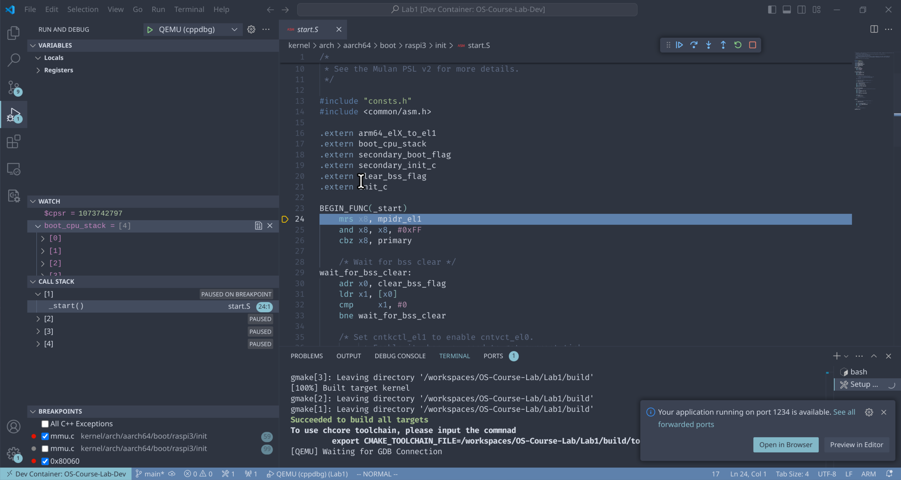
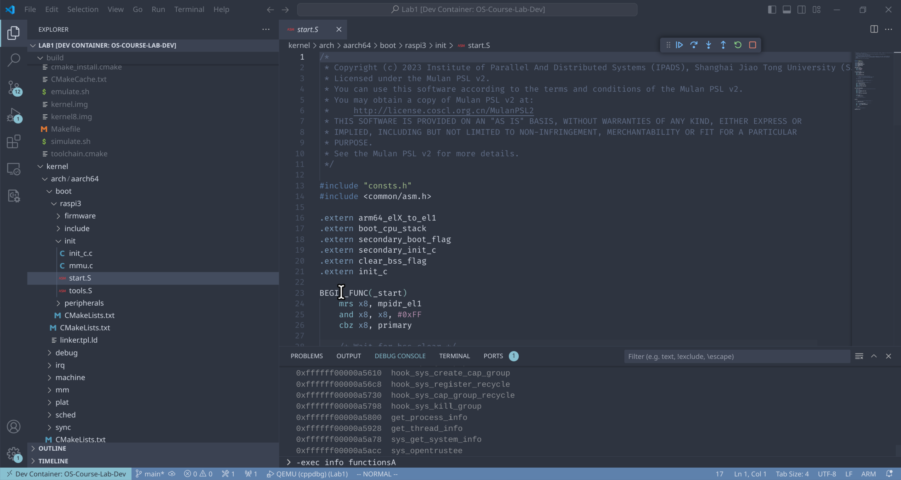
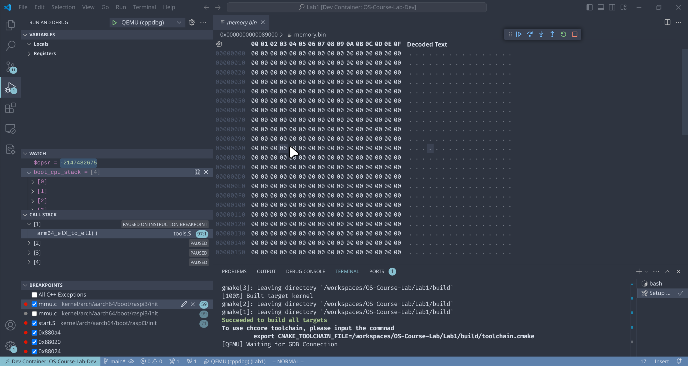

# 调试指北

<!-- toc -->

> [!IMPORTANT]
> 调试占据着你的大部分做lab的时间，本节主要讲解实验当中你可能需要使用到的调试手段，以及对应的工具使用方法.

## VSCode

在Lab0中我们学习并熟悉了GDB的使用方法，但是从Lab开始，Lab中的可调试文件就陡然增加了，使用GDB最麻烦的地方就是定位源文件进行单步调试，
同时在调试的同时我们也无法迅速的对文件进行修改来做出调整，为此我们新增加了vscode的gdb设置，使用它你就可以一步进行对于内核镜像的调试工作。

### 环境搭建

> [!IMPORTANT] Devcontainer
> 如果你使用我们提供的vscode devcontainer配置，你可以直接跳过本节。

你需要安装Microsoft所提供的官方[C/C++](https://marketplace.visualstudio.com/items?itemName=ms-vscode.cpptools-extension-pack)插件.

### 使用说明

首先你需要在make之后所生成的.config中找到`CHCORE_KENREL_DEBUG`并将其值修改`ON`。
然后运行`make clean && make`即可生成带调试符号的内核镜像。你可以使用`aarch64-linux-gnu-objdump`查看这个镜像的所有调试信息。

``` console
stu@Chcore:/workspaces/OS-Course-Lab/Lab1/build$ aarch64-linux-gnu-objdump --dwarf=info kernel.img
kernel.img:     file format elf64-littleaarch64

Contents of the .debug_info section:

  Compilation Unit @ offset 0x0:
   Length:        0x2a (32-bit)
   Version:       2
   Abbrev Offset: 0x0
   Pointer Size:  8
 <0><b>: Abbrev Number: 1 (DW_TAG_compile_unit)
    <c>   DW_AT_stmt_list   : 0x0
    <10>   DW_AT_low_pc      : 0x80000
    <18>   DW_AT_high_pc     : 0x80080
    <20>   DW_AT_name        : (indirect string, offset: 0x0): /workspaces/OS-Course-Lab/Lab1/kernel/arch/aarch64/boot/raspi3/init/start.S
    <24>   DW_AT_comp_dir    : (indirect string, offset: 0x4c): /workspaces/OS-Course-Lab/Lab1/build/kernel
    <28>   DW_AT_producer    : (indirect string, offset: 0x78): GNU AS 2.34
    <2c>   DW_AT_language    : 32769    (MIPS assembler)
...
```

> [!NOTE] DWARF
> ELF文件所使用的调试信息格式为DWARF格式，如果感兴趣你可以它的官网[^DWARF]来详细了解。

构建完成后，在左侧侧边栏找到调试按钮，点击后在上方找到`QEMU(cppdbg)`的调试设置点击调试，既可以运行我们预先准备好的vscode gdb设置。此时你的调试器会暂停自动停在`start.S`中，此时你就可以像c++课上进行debug的方式一样自由的打断点以及观察点并进行调试了。由于`qemu-system-aarch64`模拟了所有的机器核心，在左侧显示了四个线程的调用堆栈。当你关闭调试后，qemu会自动退出，与调试普通的程序是一致的.


### Debug Console

那么如果我们有的时候还是想要敲一下键盘输一些gui没有的命令，比如让gdb罗列一下这个镜像里有多少函数，此时`debug adapter protocol`协议
会帮助我们向gdb传输命令，在代码编辑栏下方的`DEBUG CONSOLE`展示的就是我们cpptools所连接的`gdb-mi`的所返回的输出，此时使用`-exec <command>`即可以如同往常我们使用gdb一样获取我们所需要的信息，如`-exec info functions` 即可以提取我们需要该镜像中的所有符号。


### Disassembler

由于我们对一些重要的代码只提供了预先编译的可链接文件，所以这些文件一般都没有调试符号，但是你仍然可以对其进行的反编译代码进行查看
例如`arm64_elX_to_el1`函数你可以使用`-exec b arm64_elX_to_el1`进行断点添加，当你点击继续执行后此时`gdb-mi`会抛出异常并停下执行。
此时打开vscode的命令面板输入`disassembly`打开反编译器面板即找到断点出的代码信息，在这个面板里你也可以使用单步调试对`汇编`进行调试。


### Hex Editor

有的时候你想对一块内存区域使用16进制编码进行查看，但是苦于gdb羸弱的表达方法效率很差，此时你可以使用Microsoft官方的`hex editor`来直接进行查看，
你可以在左方的watchpoint中输入内存地址或者变量地址，当你停下后在watchpoint的右侧会出现一个16进制的按钮点开既可以对你监视点的内存区域的
内容进行16进制的编辑与阅读。这个工具当你在苦于调试一段内存读写代码的时候很有用处。


### GDB Stub

你可能不知道由于Qemu 实现了GDB Stub的同时也给gdb stub添加了与qemu相同的指令如system, memory等等指令，所以当你暂停时你同样可以通过`-exec monitor <command>`来对qemu-monitor进行操作，例如运行`-exec monitor system_reset`此时你的qemu会从头开始重新执行，主要的关系如下

```mermaid
sequenceDiagram
    participant vscode
    participant gdb
    participant qemu
    vscode->> gdb: -exec monitor system_reset
    gdb->>qemu: monitor system_reset

```

## 代码跳转 compile_commands.json

有的时候，你可能会奇怪为什么代码提示出错了，与脚本语言不同，C/C++的lsp代码提示也是依赖于编译选项的，例如默认以及新增包含路径以及宏定义（即编译时的上下文）。如果我们不给LSP服务器提供我们浏览文件是怎么编译的，那么LSP就会按照默认的设置搜索默认的包含路径以及符号表，如果恰好你的项目里有多个同名头文件，
亦或者是在不同的文件里面定义了相同的符号，那么LSP就会报错，因为他不知道到底哪个文件以及哪个符号是参与了构建的。此时你就需要给LSP服务器提供一个提示性的信息用于告知该文件编译时的上下文。通常来说这个编译时的上下文构建系统是知道的，而llvm他们定义了一个标准的上下文文件格式即`compile_commands.json`，你可以在`build/kernel/compile_commands.json`里看到它。其记录了构建这个elf文件的过程中所使用的编译命令，此时LSP服务器即可以解析这个文件获取编译时刻的上下文信息，完成后就能得出准确的提示信息了。

```json
[
{
  "directory": "/workspaces/OS-Course-Lab/Lab1/build/kernel",
  "command": "/usr/bin/aarch64-linux-gnu-gcc -DCHCORE -DCHCORE_ARCH=\\\"aarch64\\\" -DCHCORE_ARCH_AARCH64 -DCHCORE_ASLR -DCHCORE_CROSS_COMPILE=\\\"aarch64-linux-gnu-\\\" -DCHCORE_KERNEL_DEBUG -DCHCORE_KERNEL_ENABLE_QEMU_VIRTIO_NET -DCHCORE_PLAT=\\\"raspi3\\\" -DCHCORE_PLAT_RASPI3 -DCHCORE_SUBPLAT=\\\"\\\" -DLOG_LEVEL=2 -I/workspaces/OS-Course-Lab/Lab1/kernel/include -I/workspaces/OS-Course-Lab/Lab1/kernel/user-include -I/workspaces/OS-Course-Lab/Lab1/kernel/include/arch/aarch64 -I/workspaces/OS-Course-Lab/Lab1/kernel/include/arch/aarch64/plat/raspi3 -I/workspaces/OS-Course-Lab/Lab1/kernel/arch/aarch64/boot/raspi3/include  -g   -Og -g -Wall -Werror -Wno-unused-variable -Wno-unused-function -nostdinc -ffreestanding -march=armv8-a+nofp -fno-pic -fno-pie -mcmodel=large -o CMakeFiles/kernel.img.dir/arch/aarch64/boot/raspi3/init/mmu.c.obj   -c /workspaces/OS-Course-Lab/Lab1/kernel/arch/aarch64/boot/raspi3/init/mmu.c",
  "file": "/workspaces/OS-Course-Lab/Lab1/kernel/arch/aarch64/boot/raspi3/init/mmu.c"
},
{
  "directory": "/workspaces/OS-Course-Lab/Lab1/build/kernel",
  "command": "/usr/bin/aarch64-linux-gnu-gcc -DCHCORE -DCHCORE_ARCH=\\\"aarch64\\\" -DCHCORE_ARCH_AARCH64 -DCHCORE_ASLR -DCHCORE_CROSS_COMPILE=\\\"aarch64-linux-gnu-\\\" -DCHCORE_KERNEL_DEBUG -DCHCORE_KERNEL_ENABLE_QEMU_VIRTIO_NET -DCHCORE_PLAT=\\\"raspi3\\\" -DCHCORE_PLAT_RASPI3 -DCHCORE_SUBPLAT=\\\"\\\" -DLOG_LEVEL=2 -I/workspaces/OS-Course-Lab/Lab1/kernel/include -I/workspaces/OS-Course-Lab/Lab1/kernel/user-include -I/workspaces/OS-Course-Lab/Lab1/kernel/include/arch/aarch64 -I/workspaces/OS-Course-Lab/Lab1/kernel/include/arch/aarch64/plat/raspi3 -I/workspaces/OS-Course-Lab/Lab1/kernel/arch/aarch64/boot/raspi3/include  -g   -Og -g -Wall -Werror -Wno-unused-variable -Wno-unused-function -nostdinc -ffreestanding -march=armv8-a+nofp -fno-pic -fno-pie -mcmodel=large -o CMakeFiles/kernel.img.dir/arch/aarch64/boot/raspi3/init/init_c.c.obj   -c /workspaces/OS-Course-Lab/Lab1/kernel/arch/aarch64/boot/raspi3/init/init_c.c",
  "file": "/workspaces/OS-Course-Lab/Lab1/kernel/arch/aarch64/boot/raspi3/init/init_c.c"
},
{
  "directory": "/workspaces/OS-Course-Lab/Lab1/build/kernel",
  "command": "/usr/bin/aarch64-linux-gnu-gcc -DCHCORE -DCHCORE_ARCH=\\\"aarch64\\\" -DCHCORE_ARCH_AARCH64 -DCHCORE_ASLR -DCHCORE_CROSS_COMPILE=\\\"aarch64-linux-gnu-\\\" -DCHCORE_KERNEL_DEBUG -DCHCORE_KERNEL_ENABLE_QEMU_VIRTIO_NET -DCHCORE_PLAT=\\\"raspi3\\\" -DCHCORE_PLAT_RASPI3 -DCHCORE_SUBPLAT=\\\"\\\" -DLOG_LEVEL=2 -I/workspaces/OS-Course-Lab/Lab1/kernel/include -I/workspaces/OS-Course-Lab/Lab1/kernel/user-include -I/workspaces/OS-Course-Lab/Lab1/kernel/include/arch/aarch64 -I/workspaces/OS-Course-Lab/Lab1/kernel/include/arch/aarch64/plat/raspi3 -I/workspaces/OS-Course-Lab/Lab1/kernel/arch/aarch64/boot/raspi3/include  -g   -Og -g -Wall -Werror -Wno-unused-variable -Wno-unused-function -nostdinc -ffreestanding -march=armv8-a+nofp -fno-pic -fno-pie -mcmodel=large -o CMakeFiles/kernel.img.dir/arch/aarch64/boot/raspi3/peripherals/uart.c.obj   -c /workspaces/OS-Course-Lab/Lab1/kernel/arch/aarch64/boot/raspi3/peripherals/uart.c",
  "file": "/workspaces/OS-Course-Lab/Lab1/kernel/arch/aarch64/boot/raspi3/peripherals/uart.c"
}
]

```

我们在每个lab的`.vscode`下都为`clangd`这个LSP服务器提供了`compile_commands.json`，同时也不使用`vscode`的同学们提供了`.clangd`的配置，用于引导clangd正确找到`compile_commands.json`的位置，在为LSP获取到正确的编译上下文信息后，他就可以为我们提供正常的重构，跳转，以及代码查看的功能了。

> [!NOTE] Compile Database
> 针对LLVM Compile Database的更多信息，请查阅llvm compile database的官方文档[^compile_database]

## 防御式编程 Assertions

调试器针对比较小范围的代码的作用是很大的，但大多数时候bug的发生点和异常发生点并不在同一个地方，例如在Lab1中你会配置页表，当你页表配置错误时，其实际异常也是发生在配完页表实际执行到页表所映射的虚拟内存区域时才会出错，或者当你数据结构课编写AVL树时，你会发现你访问了不该是空指针的指针，这种异常的发生和bug发生点不一致的情况，通常是由于我们违反了`不定式(invariant)`所造成的。违反不定式并不会立即造成程序崩溃，我们需要做的是让异常在程序违反不定式时立即发生，此时我们就需要使用assert了。例如在AVL树中进行左旋以及右旋的时候，你可以通常使用`assert(node->left)`, `assert(node)`等手段对其运行时行为进行检查。在ChCore中，我们准备了`BUG_ON`宏用于检查运行时的一些`expr`是否正常，除了`kinfo`以外，你可以使用这个宏来强行拦截异常，便于缩小你的debug的范围。

[^DWARF]: DWARF: <https://dwarfstd.org/dwarf5std.html>
[^compile_database]: LLVM Compile Database: <https://clang.llvm.org/docs/JSONCompilationDatabase.html>
